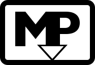
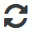
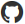

# nwjs-markdown-preview

### Download
[Just GitHub, for now](https://github.com/rbeer/nwjs-mdp.git)

### Renders GitHub Flavored Markdown

```js
const examples = {
  active: [ 'codeblocks', 'Strikethrough', 'Tables' ],
  syntaxHighlighting: true
};
```

ToDo | Done
---- | ----
~~write README.md~~ | X
have me some pizza |

### Displays images for GFM `:smiley:` tags
:1st_place_medal: :a: :libra: :smirk:

---

# USAGE
`nw mdp.nw [-d] [-w <true>] <filename.md>`
- \[-_d_\] - enable [debug mode](#debug-mode)
- \[-_w_ \<false|_true_\>\] - attach file watcher at app startup

---

# Toolbar
#  | 
You can manually refresh the output by clicking this icon.
The icon is spinning, when a document is being rendered.

# 
Shows the ouput HTML source.

-

# 
Reveals GitHub API request limit values on click.  
The icon indicates 3 states by its color:

  -  - >= 10% of available API calls left
  -  - < 10% calls left
  -  - No API calls left

When you have no API calls left, you can either wait the rest of the hour (since your first request out of 60/h) for the limit
to reset or request an auth token with your GitHub account.  
You can right click the icon and get a token, right away.

#  | 
Disable/Enable watching the content of the input file, auto-refreshing when it changes.
Enabled by default, which can be overriden with `-w false`.

-

# 
Closes the App.

---

# Debug Mode

***NOTE: You will need the SDK version of [nwjs](https://nwjs.io/) to enable debug mode.***

### 

### app._debug

The debug mode augments the main app (or `window.app`) with a `_debug` object. Its members are

  - **`exceedUnauthedRatioLimit`** [[docs](https://rbeer.github.io/nwjs-mdp/jsdoc/nwjs-mdp/0.1.0/module-_debug.html#.exceedUnauthedRatioLimit)]  
    Exceeds GitHub API call limit for unauthorized users. WARNING: This will, like _for
    realz_, ban your current IP from making any API calls, until the reset period
    (up to 1h) is over. _"I repeat, this is not a drill! ~chrrck~ "_
  - **`simulateRatioLimitError`** [[docs](https://rbeer.github.io/nwjs-mdp/jsdoc/nwjs-mdp/0.1.0/module-_debug.html#.simulateRatioLimitError)]  
    Simulates exceeded ratio limit to debug error page. This one really is a simulation.
    It doesn't make a single API call.
